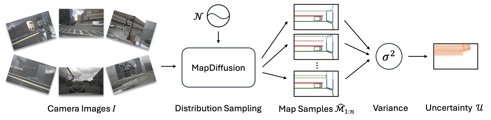

<div align="center">
  <h1>MapDiffusion</h1>
  
  <h3>[IROS 2025] MapDiffusion: Generative Diffusion for Vectorized Online HD Map Construction and Uncertainty Estimation in Autonomous Driving </h3>
  
  [](https://arxiv.org/abs/2507.21423)
  
  
</div>

## Introduction
This repository is the official implementation of MapDiffusion.

## Getting Started
### 1. Environment
**Step 1.** Create conda environment and activate it.

```
conda create --name mapdiffusion python=3.8 -y
conda activate mapdiffusion
```

**Step 2.** Install PyTorch.

```
pip install torch==1.9.0+cu111 torchvision==0.10.0+cu111 torchaudio==0.9.0 -f https://download.pytorch.org/whl/torch_stable.html
```

**Step 3.** Install MMCV series.

```
# Install mmcv-series
pip install mmcv-full==1.6.0
pip install mmdet==2.28.2
pip install mmsegmentation==0.30.0
git clone https://github.com/open-mmlab/mmdetection3d.git
cd mmdetection3d
git checkout v1.0.0rc6 
pip install -e .
```

**Step 4.** Install other requirements.

```
pip install -r requirements.txt
```

### 2. Data Preparation
**Step 1.** Download [NuScenes](https://www.nuscenes.org/download) dataset to `./datasets/nuScenes`.

**Step 2.** Generate annotation files for NuScenes dataset.

```
python tools/nuscenes_converter.py --data-root ./datasets/nuScenes --newsplit
```

### 3. Training and Validating
To train a model with 8 GPUs:

```
bash tools/dist_train.sh ${CONFIG} 8
```

To validate a model with 8 GPUs, an $\eta$ parameter of 0.5, 5 DDIM sampling steps, and a query threshold of 0.5:

```
bash tools/dist_test.sh ${CONFIG} ${CEHCKPOINT} 8 --eta=0.5 --sampling_timesteps=5 --query_threshold=0.5 --eval
```


## Results

### Results on NuScenes newsplit
| Model | $\mathrm{AP}_{ped}$ | $\mathrm{AP}_{div}$| $\mathrm{AP}_{bound}$ | $\mathrm{AP}$ | Config | Epoch |
| :---: |   :---:  |  :---:  | :---:      |:---:|:---: |:---:   |
| StreamMapNet | 31.2 | 27.3 | 42.9 | 33.8 | [Config](./plugin/configs/streammapnet.py) | 24|
| MapDiffusion | 32.9 | 31.4 | 42.4 | 35.6 | [Config](./plugin/configs/mapdiffusion.py)| 24 |


## Citation
If you find our paper or codebase useful in your research, please give us a star and cite our paper.
```
@inproceedings{monninger2025mapdiffusion,
  title        = {MapDiffusion: Generative Diffusion for Vectorized Online HD Map Construction and Uncertainty Estimation in Autonomous Driving},
  author       = {Monninger, Thomas and Zhang, Zihan and Mo, Zhipeng and Anwar, Md Zafar and Staab, Steffen and Ding, Sihao},
  booktitle    = {2025 IEEE/RSJ International Conference on Intelligent Robots and Systems (IROS)},
  pages        = {4099--4106},
  year         = {2025},
  organization = {IEEE}
}
```

## Acknowledgments
We sincerely thank the open-sourcing of these works where our code is based on:
[StreamMapNet](https://github.com/yuantianyuan01/StreamMapNet).